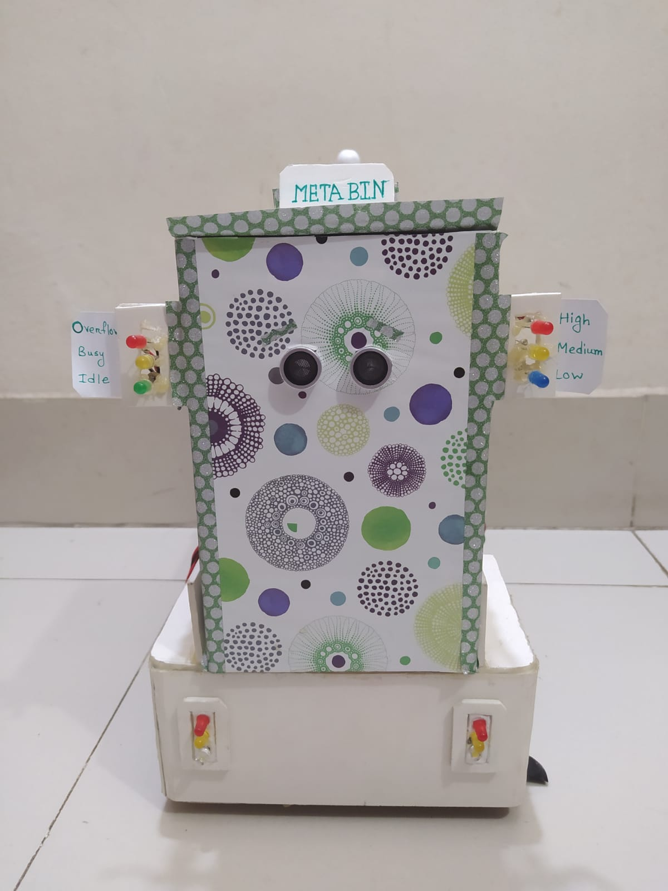
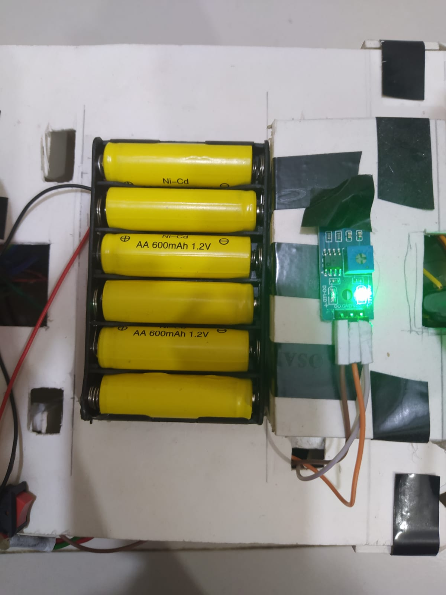
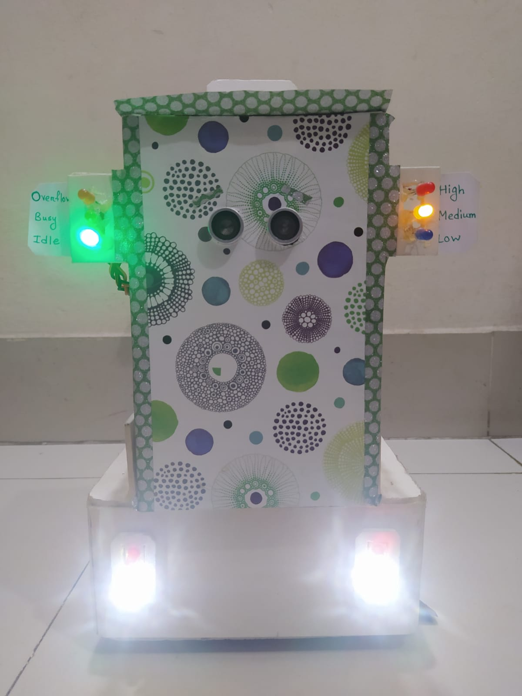

# Meta Bin – An Arduino-Based Smart Device for Collecting Trash

| WELCOME TO Meta Bin |

 ----------------
 | Introduction |
 ----------------

Meta Bin is a smart device that collects trash and is operated by human gestures. It is an Arduino-based trash collecting system. To carry META BIN a smart device "BUZZ" is introduced. To determine the amount of waste in the bin, there are three layers defined for three different amounts of garbage. The purpose of this research work is to build a clean environment at a low cost and make the garbage collecting processes easier.

Thank you everyone.

>> YouTube video link: 

-------------------
| Required System |
-------------------

 >> Any version of windows operating system which is compatible to run Arduino IDE.
 >> Arduino IDE any version

--------------------------
| Minimum Specifications |
--------------------------

    1. Operating System : Windows® 7/8/10/11
    2. Processor		: Intel® Core™ i3
    3. Memory			: 1 GB RAM
    4. Graphics			: NVIDIA MX130
    5. Network			: Broadband Internet Connection
    6. Storage			: 500 MB

-------------------------------------------------
| How to run (Using .ino extension) |
-------------------------------------------------

 >> Connect the device with desktop or laptop using USB cable.
 >> Open "META_BIN.ino" in the Arduino IDE.
 >> Arduino IDE will open the code for you.
 >> Press on the "Verify" and "Upload" option from the above toolbox.
 >> The system will be ready to use.
 >> Turn on the switch of the device.
 
--------------------
| How to use "META BIN" |
--------------------

 >> When the system starts to run, the BUZZ will go to initial mode. It will scan it's environment and go in idle mode.
 >> By simply showing the hand or garbage in front of META BIN, the lid get's opened.
 >> By moving the hand backward to forward in front of BUZZ the BUZZ will move forward.
 >> By moving the hand forward to backward in front of BUZZ the BUZZ will move backward.
 >> By moving the hand left to right in front of BUZZ the BUZZ will shift rightward.
 >> By moving the hand right to left in front of BUZZ the BUZZ will shift leftward.

---------------------------
| Background Informations |
---------------------------

The project META BIN will be a clean environment project. The world produces a huge amount of waste everyday. But the waste management system is not sufficient in all countries. To make the waste management system easier, this project introduces a smart device that can follow humans anywhere and collect trash autonomously to ensure better waste management system. This smart device can help reduce trouble for people who collect trash from roads. By putting such devices on the streets, the task of collecting garbage can be made easier. The smart device is controlled entirely by an Arduino Mega microcontroller. IoT is linked to make the process easier for authorities and to provide all instructions from a single system. As a huge amount of waste is produced every day, the management process needs more attention. This project aims to improve waste management systems in countries by making waste disposal easier. 

----------------------------
| Developer's Informations |
----------------------------
	 1. Niloy Kanti Paul
		Email		: niloykantipaul@gmail.com
		LinkedIn	: https://www.linkedin.com/in/niloy-kanti-paul-5543181ab/
		Github		: https://github.com/DEV-NKP

	 2. Kaushik Biswas
		Email		: biswaskaushik.2020@gmail.com
		LinkedIn	: https://www.linkedin.com/in/kaushik-biswas-2b6554243/
		Github		: https://github.com/Kaushik-Biswas

	 3. Dipanwita Saha
		Email		: dipanwitasaha7009@gmail.com
		LinkedIn	: https://www.linkedin.com/in/dipanwita-saha-a772aa215/
		Github		: https://github.com/Dipanwita-Saha

	 4. Rifat Tasnia Islam 
		Email		: rifattasnia521@gmail.com
		LinkedIn	: 
		Github		: 

	 5. Samia Akter
		Email		: samiatannur8888@gmail.com
		LinkedIn	: 
		Github		: 

----------------------
| Project Highlights |
----------------------

> At the very first, the BUZZ will on it's flash light and start working process.

> In the next step, the BUZZ will start its work by checking the environment.

> The front view of META BIN is made attractive.

> There are total of 6 batteries of 1.2v is needed.

> META BIN wire connection requires many wires to connect all devices.

> The green light turns on to show that the META BIN is in idle mode.

> The yellow light turns on to show that the META BIN is in busy mode.

> Among three layers the high level is indicated by red light.

> Among three layers the medium level is indicated by yellow light.

> When both the right side and left side red light turns on, it indicates that the bin is now in overflow state.

********************************************ⒸAll Rights Reserved By "TEAM_HYDRA"********************************************

